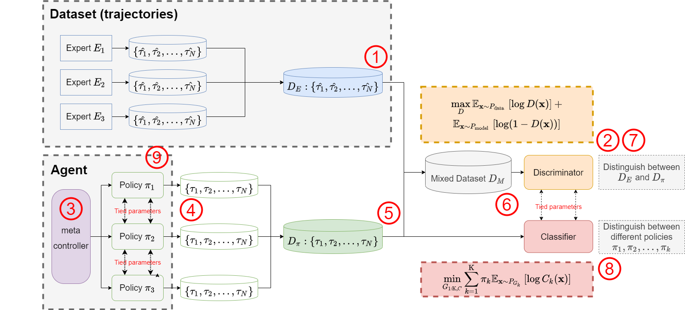

# Introduction
This is the source code for the Master thesis Multi-task Generative Adversarial Imitation Learning from National Chiao Tung University, Taiwan. 


## Multi-task Generative Adversarial Imitation Learning
Multi-task generative adversarial imitation learning (MGAIL) combines imitation learning with hierarchical reinforcement  learning. Unlike  traditional  imitation  learning,  we supposed that expert demonstration are a mixed dataset with multiple experts. With the combination of hierarchical architecture and generative adversarial imitation learning, it  can  solve  multi-task  problem  with  better  performance  and  stability.The  proposed MGAIL  is  evaluated  by  a  task-oriented  dialogue  system  which  is  known  as  an  RL scenario with sparse reward setting. Users interact with the systemor agentin orderto acquire the information they would like to know.Meanwhile, the system realizeswhat are the user intentionsthrough the conversationsin between, and therefore providesthe information  in  return. Besides, there areseveraltasks  in task-oriented  dialog  system, e.g.  restaurant  reservation, air  tickets  booking,  etc. The  agent  needs  to  handle  users’ various requirements. 



Results shows that MGAIL performs betterwhile facing multi-task problemswith sparse reward environment compared to the other imitation learning algorithm, such as behavioral cloning method, generative adversarial imitation learning


# Get starting
## Environment
The developed environment is listed in below

OS : Ubuntu 16.04
CUDA : 10.0
Nvidia Driver : 410.78
Python 3.6
Pytorch 1.2.0
The related python packages are listed in requirements.txt.


## Preprocess
### ConvLab-2 
Before starting, You should setup the ConvLab-2 package in https://github.com/thu-coai/ConvLab-2. Download the package from the link and install it.

### Create an expert dataset
We need to get a dataset for imitation learning, the record.py can help you create a dataset for our model.
* The source code is in the folder `./experiment/`.
```
$ cd experiment/
```
* execute `record.py`. choose the policy for the system in [--sys_policy], and write down the model_path in [--sys_path].
```
$ python record.py [--sys_policy] [--sys_path]
```

### training
```
$ python train.py [--sys_policy] [--sys_path]
```
